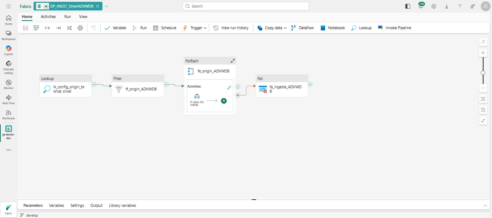

# 🗄️ DP_INGST_SilverADVWDB

> Pipeline de ingesta desde **SQL Server AdventureWorks** hacia la capa **Silver** de Microsoft Fabric.  
> Procesa las tablas **`SalesOrderDetail`** (incremental con MERGE) y **`Product`** (carga total),  
> usando un Copy Activity dinámico por tabla y notebooks PySpark para transformación y tipado.




---

## 🗺️ Diagrama del Pipeline

```
lh_config.dbo.origin_bronze_silver
           │
           ▼
  ┌──────────────────────────┐
  │  lk_config_origin        │  Lookup — lee toda la configuración activa
  │  _bronze_silver          │  firstRowOnly: false
  └────────────┬─────────────┘
               │ Succeeded
               ▼
  ┌──────────────────────────┐
  │  ft_origin_ADVWDB        │  Filter
  │                          │  @and(equals(item().origen,'ADVWDB'),
  │                          │       equals(item().activo, 1))
  └────────────┬─────────────┘
               │ Succeeded
               ▼
  ┌────────────────────────────────────────────────────────────────────┐
  │  fe_origin_ADVWDB  (ForEach — isSequential: true)                  │
  │                                                                    │
  │  ┌─────────────────────────────────────────────────────────────┐   │
  │  │  if_tabla_ADVWDB  (IfCondition)                             │   │
  │  │  @equals(item().nombre_tabla, 'SalesOrderDetail')           │   │
  │  │                                                             │   │
  │  │  TRUE  ─ SalesOrderDetail (incremental)                     │   │
  │  │  ┌────────────────────────────────────────────────────┐     │   │
  │  │  │ ca_silver_ADVWDB_SalesOrderDetail                  │     │   │
  │  │  │  SQL Server → lh_silver.ADVWDB.SalesOrderDetail    │     │   │
  │  │  │              _staging  (OverwriteSchema)           │     │   │
  │  │  │  Query: SELECT TOP 1000 * FROM Sales.SalesOrder    │     │   │
  │  │  │         Detail WHERE ModifiedDate > '{watermark}'  │     │   │
  │  │  │         ORDER BY ModifiedDate ASC                  │     │   │
  │  │  └────────────────────┬───────────────────────────────┘     │   │
  │  │                       │ Succeeded                           │   │
  │  │                       ▼                                     │   │
  │  │  ┌────────────────────────────────────────────────────┐     │   │
  │  │  │ nb_silver_ADVWDB_SalesOrderDetail                  │     │   │
  │  │  │  Staging → tipado → MERGE Delta Lake               │     │   │
  │  │  │  Actualiza watermark en lh_config                  │     │   │
  │  │  └────────────────────────────────────────────────────┘     │   │
  │  │                                                             │   │
  │  │  FALSE ─ Product (carga total)                              │   │
  │  │  ┌────────────────────────────────────────────────────┐     │   │
  │  │  │ ca_silver_ADVWDB_Product                           │     │   │
  │  │  │  SQL Server → lh_silver.ADVWDB.Product_staging     │     │   │
  │  │  │  Query: SELECT TOP 1000 * FROM Production.Product  │     │   │
  │  │  │         ORDER BY ProductID                         │     │   │
  │  │  └────────────────────┬───────────────────────────────┘     │   │
  │  │                       │ Succeeded                           │   │
  │  │                       ▼                                     │   │
  │  │  ┌────────────────────────────────────────────────────┐     │   │
  │  │  │ nb_silver_ADVWDB_Product                           │     │   │
  │  │  │  Staging → tipado → DROP TABLE → saveAsTable       │     │   │
  │  │  └────────────────────────────────────────────────────┘     │   │
  │  └─────────────────────────────────────────────────────────────┘   │
  └────────────────────────────────────────────────────────────────────┘
               │ Failed
               ▼
  ┌──────────────────────────┐
  │  fa_ingesta_ADVWDB       │  Fail — expone error con código ADVWDB_SILVER_FAIL
  └──────────────────────────┘
```

---

## ⚙️ Actividades

| # | Actividad | Tipo | Descripción |
|---|-----------|------|-------------|
| 1 | `lk_config_origin_bronze_silver` | Lookup | Lee todas las tablas activas desde `lh_config.dbo.origin_bronze_silver` (`firstRowOnly: false`) |
| 2 | `ft_origin_ADVWDB` | Filter | Filtra `origen = 'ADVWDB'` AND `activo = 1` |
| 3 | `fe_origin_ADVWDB` | ForEach | Itera cada tabla en secuencia (`isSequential: true`) |
| 4 | `if_tabla_ADVWDB` | IfCondition | Bifurca por tabla: `SalesOrderDetail` (TRUE) o `Product` (FALSE) |
| 5 | `ca_silver_ADVWDB_SalesOrderDetail` | Copy | SQL Server → `lh_silver.ADVWDB.SalesOrderDetail_staging` (query incremental) |
| 6 | `nb_silver_ADVWDB_SalesOrderDetail` | Notebook | Staging → tipado → **MERGE Delta Lake** → actualiza watermark |
| 7 | `ca_silver_ADVWDB_Product` | Copy | SQL Server → `lh_silver.ADVWDB.Product_staging` (query total) |
| 8 | `nb_silver_ADVWDB_Product` | Notebook | Staging → tipado → DROP TABLE → saveAsTable |
| 9 | `fa_ingesta_ADVWDB` | Fail | Se activa si el ForEach falla. Código de error: `ADVWDB_SILVER_FAIL` |

---

## 🔀 Lógica del IfCondition

```
@equals(item().nombre_tabla, 'SalesOrderDetail')
          │
    ┌─────┴──────┐
  TRUE          FALSE
    │              │
SalesOrderDetail  Product
(incremental)    (total)
```

El mismo ForEach maneja ambas tablas. El IfCondition separa la lógica sin duplicar la estructura del pipeline.

---

## 🔌 Origen de los Datos

| Parámetro | Valor |
|-----------|-------|
| **Tipo** | SQL Server — AdventureWorks2019 |
| **Conexión** | `cafffe28-7d56-4ca4-ac0e-3ac73f036368` (conexión administrada en Fabric) |
| **Tabla SOD** | `Sales.SalesOrderDetail` |
| **Tabla Product** | `Production.Product` |
| **Límite desarrollo** | `TOP 1000` (obligatorio TP) |

### Queries SQL dinámicas

**SalesOrderDetail — incremental con watermark:**
```sql
-- Expresión Data Factory (dinámica)
@concat(
  'SELECT TOP 1000 * FROM Sales.SalesOrderDetail ',
  'WHERE ModifiedDate > ''', item().ultimo_valor_incremental, ''' ',
  'ORDER BY ModifiedDate ASC'
)

-- Resultado en ejecución:
SELECT TOP 1000 * FROM Sales.SalesOrderDetail
WHERE ModifiedDate > '2024-03-15 10:30:00'
ORDER BY ModifiedDate ASC
```

**Product — total fija:**
```sql
SELECT TOP 1000 * FROM Production.Product
ORDER BY ProductID
```

---

## 📋 Configuración — `lh_config.dbo.origin_bronze_silver`

```sql
SELECT *
FROM lh_config.dbo.origin_bronze_silver
WHERE origen = 'ADVWDB'
  AND activo = 1
```

| Campo | SalesOrderDetail | Product |
|-------|-----------------|---------|
| `nombre_tabla` | `SalesOrderDetail` | `Product` |
| `origen` | `ADVWDB` | `ADVWDB` |
| `pks` | `SalesOrderID,SalesOrderDetailID` | `ProductID` |
| `tipo_carga` | `incremental` | `total` |
| `parametros_incrementales` | `ModifiedDate` | _(no aplica)_ |
| `ultimo_valor_incremental` | `2024-03-15 10:30:00` ← **se auto-actualiza** | _(no aplica)_ |
| `activo` | `1` | `1` |

---

## 🏗️ Patrón Staging

> El Copy Activity **no escribe directamente** en la tabla Silver final.  
> Escribe en un **staging intermedio** dentro de `lh_silver`, que el notebook lee y procesa.

```
SQL Server AdventureWorks
        │
        │  [Copy Activity]
        ▼
lh_silver.ADVWDB.SalesOrderDetail_staging  ← tabla temporal
lh_silver.ADVWDB.Product_staging           ← tabla temporal
        │
        │  [Notebook PySpark]
        ▼
lh_silver.ADVWDB.SalesOrderDetail          ← tabla final Silver
lh_silver.ADVWDB.Product                   ← tabla final Silver
```

**Ventajas del patrón staging:**
- El notebook puede fallar y reintentar sin repetir el Copy Data
- Desacopla la velocidad de copia SQL del procesamiento Spark
- Permite diagnóstico: si el staging está vacío, el problema es la query SQL, no el notebook
- El staging se elimina al finalizar el notebook (`DROP TABLE IF EXISTS`)

---

## 📓 Notebooks

### 🥈 `NB_TRNSF_SilverADVWDB_Product`

**Propósito:** Leer staging de Product, tipar correctamente y sobreescribir Silver (carga total).

| Celda | Función |
|-------|---------|
| 0 — Config | Lee `lh_config`, obtiene IDs con `lakehouse.get()`, construye `tabla_staging` y `tabla_silver` dinámicamente |
| 1 — Leer staging | `SELECT * FROM lh_silver.ADVWDB.Product_staging LIMIT 1000` con diagnóstico detallado si no existe |
| 2 — Tipado y limpieza | Cast de 15 columnas, trim de strings con reemplazo de vacíos por NULL, diagnóstico de NULLs en PK |
| 3 — Escribir Silver | `DROP TABLE IF EXISTS` + `saveAsTable` overwrite + limpia staging |
| 4 — Verificar | COUNT total + `SELECT ProductID, Name, ListPrice LIMIT 10` |

**Tipado completo (15 columnas):**

| Columna | Tipo |
|---------|------|
| `ProductID` | `integer` |
| `MakeFlag` | `boolean` |
| `FinishedGoodsFlag` | `boolean` |
| `SafetyStockLevel` | `smallint` |
| `ReorderPoint` | `smallint` |
| `StandardCost` | `decimal(18,4)` |
| `ListPrice` | `decimal(18,4)` |
| `Weight` | `decimal(8,2)` |
| `DaysToManufacture` | `integer` |
| `ProductSubcategoryID` | `integer` |
| `ProductModelID` | `integer` |
| `SellStartDate` | `timestamp` |
| `SellEndDate` | `timestamp` |
| `DiscontinuedDate` | `timestamp` |
| `ModifiedDate` | `timestamp` |

**Columnas string** (trim + vacío→NULL): `Name`, `ProductNumber`, `Color`, `Size`, `ProductLine`, `Class`, `Style`, `SizeUnitMeasureCode`, `WeightUnitMeasureCode`

**Escritura Silver (carga total):**

```python
# DROP TABLE limpia metastore Y archivos Delta físicos
spark.sql(f'DROP TABLE IF EXISTS {tabla_silver}')

df_silver.write
    .format('delta')
    .mode('overwrite')
    .option('overwriteSchema', 'true')
    .saveAsTable(tabla_silver)

# Limpia staging al finalizar
spark.sql(f'DROP TABLE IF EXISTS {tabla_staging}')
```

---

### 🥈 `NB_TRNSF_SilverADVWDB_SalesOrderDetail`

**Propósito:** Leer staging de SalesOrderDetail, tipar y ejecutar **UPSERT (MERGE Delta Lake)** sobre Silver.

| Celda | Función |
|-------|---------|
| 0 — Config | Lee `lh_config`, obtiene IDs con `lakehouse.get()`, construye `tabla_staging`, `tabla_silver` y `abfs_silver` |
| 1 — Reproceso | Detecta parámetros de reproceso. Si activo: DELETE Silver del rango + reset watermark |
| 2 — Leer staging | `SELECT * FROM lh_silver.ADVWDB.SalesOrderDetail_staging LIMIT 1000` |
| 3 — Tipado y limpieza | Cast de 10 columnas, dropna/dropDuplicates sobre PKs de config |
| 4 — MERGE Delta | Condición dinámica desde PKs de config + `whenMatchedUpdateAll` + `whenNotMatchedInsertAll` |
| 5 — Watermark + limpieza | `UPDATE lh_config SET ultimo_valor_incremental = MAX(ModifiedDate)` + `DROP TABLE staging` |
| 6 — Verificar | COUNT + GROUP BY ModifiedDate con SUM(LineTotal) |

**Tipado completo (10 columnas):**

| Columna | Tipo |
|---------|------|
| `SalesOrderID` | `integer` |
| `SalesOrderDetailID` | `integer` |
| `OrderQty` | `smallint` |
| `ProductID` | `integer` |
| `SpecialOfferID` | `integer` |
| `UnitPrice` | `decimal(18,4)` |
| `UnitPriceDiscount` | `decimal(18,4)` |
| `LineTotal` | `decimal(38,6)` |
| `CarrierTrackingNumber` | `string` (trim) |
| `ModifiedDate` | `timestamp` |

**MERGE Delta Lake (UPSERT):**

```python
# Condición de merge construida dinámicamente desde PKs en config
# pks = ['SalesOrderID', 'SalesOrderDetailID']  ← leído de lh_config
merge_condition = ' AND '.join(
    [f'target.{pk} = source.{pk}' for pk in pks]
)
# → "target.SalesOrderID = source.SalesOrderID AND target.SalesOrderDetailID = source.SalesOrderDetailID"

try:
    # Cargas 2+ → MERGE sobre tabla existente
    target = DeltaTable.forPath(spark, abfs_silver)
    (target.alias('target')
        .merge(df_silver.alias('source'), merge_condition)
        .whenMatchedUpdateAll()      # si existe → actualiza todos los campos
        .whenNotMatchedInsertAll()   # si es nuevo → inserta
        .execute())

except Exception:
    # Primera carga → tabla no existe aún → overwrite inicial
    df_silver.write.format('delta').mode('overwrite').saveAsTable(tabla_silver)
```

**Actualización de watermark:**

```python
# MAX(ModifiedDate) del Silver post-MERGE → próxima ejecución solo trae registros más nuevos
max_fecha = spark.sql(f'SELECT MAX(ModifiedDate) FROM {tabla_silver}').collect()[0][0]

spark.sql(f"""
    UPDATE lh_config.dbo.origin_bronze_silver
    SET ultimo_valor_incremental = '{max_fecha}'
    WHERE origen = 'ADVWDB' AND nombre_tabla = 'SalesOrderDetail'
""")
```

---

## 🔄 Flujo de Datos Detallado

```
SQL Server AdventureWorks2019
├── Sales.SalesOrderDetail
│     WHERE ModifiedDate > '2024-03-15 ...'  ← watermark dinámico
│     ORDER BY ModifiedDate ASC
│     TOP 1000
│
└── Production.Product
      ORDER BY ProductID
      TOP 1000

       │
       │  [ca_silver_ADVWDB_*]  Copy Activity — SqlServerSource → LakehouseTableSink
       ▼
lh_silver.ADVWDB.SalesOrderDetail_staging  (OverwriteSchema)
lh_silver.ADVWDB.Product_staging           (OverwriteSchema)

       │
       │  [nb_silver_ADVWDB_*]  Notebook PySpark
       │
       │  SalesOrderDetail:
       │    Tipado 10 cols → MERGE Delta (UPDATE + INSERT)
       │    → UPDATE lh_config watermark = MAX(ModifiedDate)
       │    → DROP TABLE staging
       │
       │  Product:
       │    Tipado 15 cols → DROP TABLE + saveAsTable overwrite
       │    → DROP TABLE staging
       ▼
lh_silver.ADVWDB.SalesOrderDetail  (Delta — incremental MERGE)
lh_silver.ADVWDB.Product           (Delta — total overwrite)
```

---

## 🔁 Lógica de Reproceso — SalesOrderDetail (🌟 Bonus)

```python
# Activar pasando parámetros al notebook via pipeline o manualmente
fecha_inicio_reproceso = "2024-01-01 00:00:00"
fecha_fin_reproceso    = "2024-01-31 23:59:59"
```

**Secuencia de reproceso:**

```
1. 🗑️  DELETE FROM lh_silver.ADVWDB.SalesOrderDetail
        WHERE ModifiedDate >= 'fecha_inicio' AND ModifiedDate <= 'fecha_fin'

2. 🔄  UPDATE lh_config.dbo.origin_bronze_silver
        SET ultimo_valor_incremental = 'fecha_inicio'
        WHERE origen = 'ADVWDB' AND nombre_tabla = 'SalesOrderDetail'

3. ✅  El Copy Activity re-ejecuta con el watermark reseteado
       trayendo todos los registros del rango desde SQL Server

4. 🔀  MERGE escribe los registros limpios sin duplicados
```

> **Garantía:** nunca genera duplicados. DELETE antes de reescribir siempre.

---

## 🛡️ Políticas de Ejecución

| Actividad | Timeout | Retry | Retry Delay |
|-----------|---------|-------|-------------|
| Copy (SalesOrderDetail) | 15 min | 1 | 30 seg |
| Copy (Product) | 15 min | 1 | 30 seg |
| Notebook (SalesOrderDetail) | 30 min | 2 | _(default)_ |
| Notebook (Product) | 30 min | 2 | _(default)_ |

---

## 🛡️ Manejo de Errores

| Escenario | Comportamiento |
|-----------|---------------|
| Staging vacío (sin registros nuevos) | `notebookutils.notebook.exit('sin_datos_nuevos')` — pipeline continúa sin error |
| Staging no existe (Copy falló) | El notebook lanza `Exception` con diagnóstico detallado → activa `fa_ingesta_ADVWDB` |
| Primera carga SOD (tabla Silver no existe) | `DeltaTable.forPath` falla → `except` hace `saveAsTable` overwrite inicial |
| Fallo en MERGE | Retry automático x2 (timeout 30min) → si persiste activa `fa_ingesta_ADVWDB` |
| Fallo en Copy Activity | Retry automático x1 (30s delay) → si persiste activa `fa_ingesta_ADVWDB` |
| NULLs en PK después del cast | Diagnóstico explícito antes de `dropna` → muestra filas problemáticas con `display()` |
| `fa_ingesta_ADVWDB` (Fail) | Expone error con código `ADVWDB_SILVER_FAIL` en el Monitor de Fabric |

---

## 📊 Runs Verificados en Producción

| Fecha | Actividades | Duración | Estado |
|-------|------------|---------|--------|
| 09/03/2026 23:42 | 9 / 9 | 10m 29s | ✅ Succeeded |
| 08/03/2026 19:19 | 9 / 9 | 6m 31s | ✅ Succeeded |

### Desglose de actividades (9 total)

```
lk_config_origin_bronze_silver       →  1 actividad
ft_origin_ADVWDB                     →  1 actividad
fe_origin_ADVWDB (ForEach × 2 tablas)
  └── Por tabla (× 2):
      if_tabla_ADVWDB                →  2 actividades  (IfCondition evalúa)
      ca_silver_ADVWDB_{tabla}       →  2 actividades  (Copy SQL→staging)
      nb_silver_ADVWDB_{tabla}       →  2 actividades  (Notebook)
fa_ingesta_ADVWDB (no disparado)     →  0 actividades
─────────────────────────────────────────────────────
Total                                →  9 actividades ✅
```

---

## 🔗 Recursos Relacionados

| Recurso | Descripción |
|---------|-------------|
| [`DP_ORCHS_Origenes`](../DP_ORCHS_Origenes/) | Orquestador maestro que invoca este pipeline |
| [`NB_TRNSF_SilverADVWDB_Product.ipynb`](./notebooks/NB_TRNSF_SilverADVWDB_Product.ipynb) | Notebook Silver Product |
| [`NB_TRNSF_SilverADVWDB_SalesOrderDetail.ipynb`](./notebooks/NB_TRNSF_SilverADVWDB_SalesOrderDetail.ipynb) | Notebook Silver SalesOrderDetail |
| [`DP_INGST_SilverADVWDB.json`](./DP_INGST_SilverADVWDB.json) | JSON del pipeline |

---

*TP Final — Ingeniería de Datos en Microsoft Fabric — Euler, Diego — Marzo 2026*
