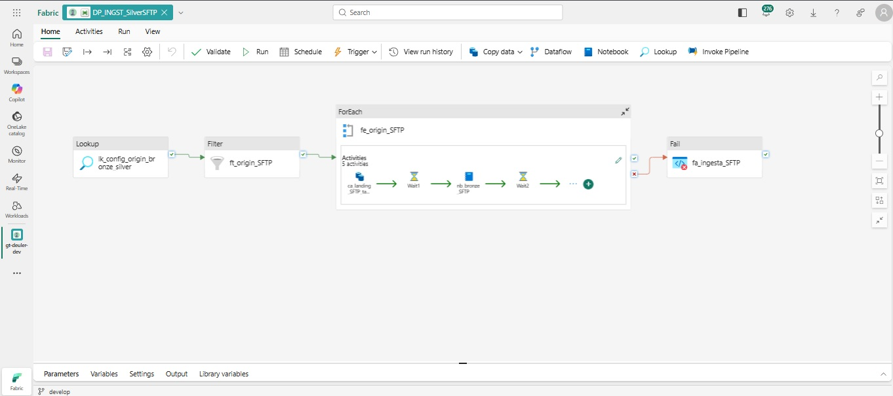

# 📂 DP_INGST_SilverSFTP

> Pipeline de ingesta de archivos CSV (fuente SFTP simulada) hacia la capa **Silver** de Microsoft Fabric.  
> Procesa las tablas **`SalesOrderHeader`** (incremental) y **`Person`** (total), pasando por Bronze antes de llegar a Silver.




---

## 🗺️ Diagrama del Pipeline

```
lh_config.dbo.origin_bronze_silver
           │
           ▼
  ┌─────────────────┐
  │  lk_config      │  Lookup — lee configuración de todas las tablas SFTP activas
  │  origin_bronze  │
  └────────┬────────┘
           │ Succeeded
           ▼
  ┌─────────────────┐
  │  ft_origin_SFTP │  Filter — filtra origen = 'SFTP' AND activo = 1
  └────────┬────────┘
           │ Succeeded
           ▼
  ┌─────────────────────────────────────────────────────────────┐
  │  fe_origin_SFTP  (ForEach — isSequential: true)             │
  │                                                             │
  │  Por cada tabla (Person, SalesOrderHeader):                 │
  │                                                             │
  │  ┌──────────────────┐                                       │
  │  │ ca_landing_SFTP  │  Copy — CSV (lh_origin) → lh_landing  │
  │  └────────┬─────────┘                                       │
  │           │ Succeeded                                       │
  │           ▼                                                 │
  │  ┌──────────────────┐                                       │
  │  │    Wait1 (90s)   │  Espera: disponibilidad del archivo   │
  │  └────────┬─────────┘                                       │
  │           │ Succeeded                                       │
  │           ▼                                                 │
  │  ┌──────────────────┐                                       │
  │  │  nb_bronze_SFTP  │  Notebook — Landing → Bronze          │
  │  └────────┬─────────┘                                       │
  │           │ Succeeded                                       │
  │           ▼                                                 │
  │  ┌──────────────────┐                                       │
  │  │   Wait2 (180s)   │  Espera: liberar sesión Spark/Livy   │
  │  └────────┬─────────┘                                       │
  │           │ Succeeded                                       │
  │           ▼                                                 │
  │  ┌──────────────────┐                                       │
  │  │  nb_silver_SFTP  │  Notebook — Bronze → Silver           │
  │  └──────────────────┘                                       │
  └─────────────────────────────────────────────────────────────┘
           │ Failed
           ▼
  ┌─────────────────┐
  │ fa_ingesta_SFTP │  Fail — expone el error en Monitor
  └─────────────────┘
```

---

## ⚙️ Actividades

| # | Actividad | Tipo | Descripción |
|---|-----------|------|-------------|
| 1 | `lk_config_origin_bronze_silver` | Lookup | Lee todas las tablas SFTP activas desde `lh_config.dbo.origin_bronze_silver` |
| 2 | `ft_origin_SFTP` | Filter | Filtra registros con `origen = 'SFTP'` y `activo = 1` |
| 3 | `fe_origin_SFTP` | ForEach | Itera cada tabla en secuencia (`isSequential: true`) |
| 4 | `ca_landing_SFTP_tabla` | Copy (Binary) | Copia el archivo CSV desde `lh_origin_get_talent` → `lh_landing` |
| 5 | `Wait1` | Wait | **90 segundos** — garantiza disponibilidad del archivo antes del notebook |
| 6 | `nb_bronze_SFTP` | Notebook | Ejecuta el notebook Bronze correspondiente a la tabla |
| 7 | `Wait2` | Wait | **180 segundos** — libera la sesión Livy antes del siguiente notebook |
| 8 | `nb_silver_SFTP` | Notebook | Ejecuta el notebook Silver correspondiente a la tabla |
| 9 | `fa_ingesta_SFTP` | Fail | Se activa si el ForEach falla. Expone error en Monitor de Fabric |

---

## 📋 Configuración — `lh_config.dbo.origin_bronze_silver`

El pipeline lee dinámicamente sus parámetros desde la tabla de configuración.  
**No hay ningún hardcodeo** de nombres de tabla, rutas ni fechas.

```sql
SELECT *
FROM lh_config.dbo.origin_bronze_silver
WHERE origen = 'SFTP'
  AND activo = 1
```

| Campo | Ejemplo Person | Ejemplo SalesOrderHeader |
|-------|---------------|--------------------------|
| `nombre_tabla` | `Person` | `SalesOrderHeader` |
| `origen` | `SFTP` | `SFTP` |
| `pks` | `BusinessEntityID` | `SalesOrderID` |
| `tipo_carga` | `total` | `incremental` |
| `parametros_incrementales` | `fecha_archivo` | `fecha_archivo` |
| `ultimo_valor_incremental` | _(no aplica)_ | `20240315` ← se actualiza automáticamente |
| `activo` | `1` | `1` |

---

## 📁 Convención de Archivos de Entrada

```
lh_origin_get_talent/Files/
├── Person_20240301.csv
├── SalesOrderHeader_20240101.csv
├── SalesOrderHeader_20240201.csv
├── SalesOrderHeader_20240301.csv
└── SalesOrderHeader_20240401.csv
```

> **Formato:** `NombreTabla_AAAAMMDD.csv`  
> El sufijo `AAAAMMDD` es el **watermark** que determina qué archivos son nuevos.

---

## 📓 Notebooks

### 🥉 `NB_INGST_BronzeSFTP_Person`

**Propósito:** Leer el archivo CSV de Person y escribir en Bronze con todas las columnas como `string`.

| Celda | Función |
|-------|---------|
| 0 — Config | Lee `lh_config`, construye `abfs_origen` y `tabla_bronze` dinámicamente |
| 1 — Listar archivos | `notebookutils.fs.ls(abfs_origen)` — detecta todos los CSV de Person |
| 2 — Leer y escribir Bronze | Lee CSV con `LIMIT 1000`, castea TODO a `string`, escribe en Bronze con `append` + auditoría |
| 3 — Verificar | `SELECT COUNT(*), GROUP BY nombre_archivo` |

**Columnas de auditoría agregadas:**

```python
.withColumn('fecha_carga',    F.lit(datetime.now().strftime('%Y-%m-%d %H:%M:%S')))
.withColumn('origen_capa',    F.lit('SFTP'))
.withColumn('nombre_archivo', F.lit(archivo['name']))
.withColumn('fecha_archivo',  F.lit(archivo['fecha']))   # AAAAMMDD del nombre del archivo
```

**Estrategia de carga:** `append` (modo total — no usa watermark, carga siempre todos los archivos disponibles).

---

### 🥉 `NB_INGST_BronzeSFTP_SalesOrderHeader`

**Propósito:** Detectar archivos CSV de SalesOrderHeader **nuevos** por watermark y escribir en Bronze.

| Celda | Función |
|-------|---------|
| 0 — Config | Lee `lh_config`, obtiene `ultimo_valor_incremental` y `parametros_incrementales` (`fecha_archivo`) |
| 1 — Reproceso | Detecta parámetros `fecha_inicio_reproceso` / `fecha_fin_reproceso` (modo bonus) |
| 2 — Filtrar archivos | Compara `fecha_archivo > ultimo_valor` — solo procesa archivos nuevos |
| 3 — Leer y escribir Bronze | Lee CSV con `LIMIT 1000`, castea TODO a `string`, `append` a Bronze |
| 4 — Actualizar watermark | `UPDATE lh_config SET ultimo_valor_incremental = MAX(fecha_archivo)` |
| 5 — Verificar | COUNT agrupado por `fecha_archivo` |

**Lógica de watermark:**

```python
# Archivos disponibles en lh_origin_get_talent
archivos_disponibles = notebookutils.fs.ls(abfs_origen)

# Extrae fecha AAAAMMDD del nombre del archivo con regex
fecha_archivo = re.search(r'_(\d{8})\.csv$', archivo.name).group(1)

# Solo procesa archivos posteriores al último watermark
if fecha_archivo > ultimo_valor:
    archivos_nuevos.append(archivo)
```

**Lógica de reproceso (🌟 Bonus):**

```python
# Si se reciben parámetros → modo reproceso
fecha_inicio_reproceso = notebookutils.notebook.getParameter('fecha_inicio_reproceso', '')
fecha_fin_reproceso    = notebookutils.notebook.getParameter('fecha_fin_reproceso', '')

if modo_reproceso:
    # Elimina Bronze del rango → reprocesa desde cero sin duplicados
    spark.sql(f"DELETE FROM {tabla_bronze} WHERE fecha_archivo >= '{fecha_inicio_reproceso}'
               AND fecha_archivo <= '{fecha_fin_reproceso}'")
```

---

### 🥈 `NB_TRNSF_SilverSFTP_Person`

**Propósito:** Leer Bronze Person, aplicar tipado correcto y escribir Silver (carga total).

| Celda | Función |
|-------|---------|
| 0 — Config | Lee `lh_config`, obtiene IDs con `lakehouse.get()`, construye `abfs_silver` |
| 1 — Leer Bronze | `SELECT * FROM lh_bronze.SFTP.Person LIMIT 1000` |
| 2 — Tipado y limpieza | Cast de columnas, trim de strings, dropna/dropDuplicates sobre PK |
| 3 — Escribir Silver | `notebookutils.fs.rm(abfs_silver)` + `write.overwrite.save(abfs_silver)` |
| 4 — Verificar | `spark.read.format("delta").load(abfs_silver)` |

**Transformaciones aplicadas:**

```python
df_silver = (df_bronze
    .withColumn("BusinessEntityID", F.col("BusinessEntityID").cast("integer"))
    .withColumn("EmailPromotion",   F.col("EmailPromotion").cast("integer"))
    .withColumn("ModifiedDate",     F.col("ModifiedDate").cast("timestamp"))
)

# Trim en columnas string
for c in ["PersonType", "FirstName", "LastName", "MiddleName", "Suffix", "Title"]:
    df_silver = df_silver.withColumn(c, F.trim(F.col(c)))

# Limpieza desde PKs de config — nunca hardcodeadas
df_silver = df_silver.dropna(subset=pks).dropDuplicates(pks)
```

**Estrategia de escritura:** `overwrite` total con `notebookutils.fs.rm()` previo.

---

### 🥈 `NB_TRNSF_SilverSFTP_SalesOrderHeader`

**Propósito:** Leer solo registros **nuevos** de Bronze SOH respecto a Silver, tipar y hacer `append` incremental.

| Celda | Función |
|-------|---------|
| 0 — Config | Lee `lh_config`, IDs con `lakehouse.get()`, construye `abfs_silver` |
| 1 — Reproceso | Detecta modo reproceso. Si activo: `DELETE FROM lh_silver.SFTP.SalesOrderHeader WHERE fecha_archivo BETWEEN ...` |
| 2 — Leer Bronze incremental | Detecta `MAX(fecha_archivo)` en Silver → filtra Bronze con `WHERE fecha_archivo > ultimo_silver ORDER BY fecha_archivo LIMIT 1000` |
| 3 — Tipado y limpieza | Cast de 17 columnas, conversión coma→punto en decimales, Unix timestamp→date |
| 4 — Escribir Silver | `write.append.save(abfs_silver)` |
| 5 — Verificar | GROUP BY `fecha_archivo` con COUNT, SUM(TotalDue) |

**Transformaciones especiales:**

```python
# ⚠️ Los CSVs usan coma como separador decimal (convención argentina)
for c in ["TotalDue", "SubTotal", "TaxAmt", "Freight"]:
    df_silver = df_silver.withColumn(c, F.regexp_replace(F.col(c), ",", "."))

# ⚠️ Fechas en Unix timestamp (segundos) → date
for c in ["OrderDate", "DueDate", "ShipDate"]:
    df_silver = df_silver.withColumn(
        c, F.to_date(F.from_unixtime(F.col(c).cast("bigint")))
    )
```

**Tipado completo (17 columnas):**

| Columna | Tipo |
|---------|------|
| `SalesOrderID` | `integer` |
| `RevisionNumber` | `integer` |
| `Status` | `integer` |
| `OnlineOrderFlag` | `boolean` |
| `CustomerID` | `integer` |
| `SalesPersonID` | `integer` |
| `TerritoryID` | `integer` |
| `BillToAddressID` | `integer` |
| `ShipToAddressID` | `integer` |
| `ShipMethodID` | `integer` |
| `CreditCardID` | `integer` |
| `CurrencyRateID` | `integer` |
| `SubTotal` | `decimal(18,4)` |
| `TaxAmt` | `decimal(18,4)` |
| `Freight` | `decimal(18,4)` |
| `TotalDue` | `decimal(18,4)` |
| `ModifiedDate` | `timestamp` |

---

## 🔄 Flujo de Datos Detallado

```
lh_origin_get_talent (lh_landing)
│   SalesOrderHeader_20240101.csv  ┐
│   SalesOrderHeader_20240201.csv  │ Archivos CSV "sucios"
│   SalesOrderHeader_20240301.csv  │ (coma decimal, Unix timestamp,
│   SalesOrderHeader_20240401.csv  ┘  columnas string)
│   Person_20240301.csv
│
│  [ca_landing_SFTP_tabla]  Copy Binary
▼
lh_landing
│
│  [Wait 90s]
│  [nb_bronze_SFTP]  NB_INGST_BronzeSFTP_{tabla}
│    └── TODO a string + auditoría (fecha_carga, nombre_archivo, fecha_archivo)
▼
lh_bronze.SFTP.{tabla}  (Delta — todas string)
│
│  [Wait 180s]
│  [nb_silver_SFTP]  NB_TRNSF_SilverSFTP_{tabla}
│    ├── Person     → tipado 3 cols  + overwrite total
│    └── SOH        → tipado 17 cols + append incremental + watermark
▼
lh_silver.SFTP.{tabla}  (Delta — tipos correctos)
```

---

## ⏱️ Por qué los Waits

> El entorno **Trial de Microsoft Fabric** tiene capacidad limitada de sesiones Spark/Livy concurrentes.  
> Sin las esperas, los notebooks de tablas consecutivas dentro del mismo ForEach compiten por la misma sesión y fallan con error **HTTP 430 — Too Many Requests**.

| Wait | Tiempo | Propósito |
|------|--------|-----------|
| `Wait1` | **90 seg** | Garantiza que el archivo binario copiado por la actividad Copy esté completamente disponible y registrado en el metastore antes de que el notebook Spark intente leerlo. |
| `Wait2` | **180 seg** | Libera la sesión Livy del notebook Bronze antes de iniciar el notebook Silver. Evita el error 430 en entorno Trial. |

---

## 🛡️ Manejo de Errores

| Escenario | Comportamiento |
|-----------|---------------|
| Sin archivos nuevos (SOH) | `notebookutils.notebook.exit('sin_archivos_nuevos')` — el pipeline continúa sin error |
| Sin archivos disponibles (Person) | `notebookutils.notebook.exit('sin_archivos')` — el pipeline continúa sin error |
| Fallo en cualquier actividad del ForEach | `fa_ingesta_SFTP` (actividad Fail) se activa → expone error con código `SFTP_SILVER_FAIL` en Monitor |
| Copy Activity falla | `retry: 1`, `retryIntervalInSeconds: 30`, `timeout: 15 minutos` |

---

## 🌟 Lógica de Reproceso (Bonus)

Los notebooks `NB_INGST_BronzeSFTP_SalesOrderHeader` y `NB_TRNSF_SilverSFTP_SalesOrderHeader` soportan reprocesamiento por rango de fechas mediante parámetros de notebook.

### Cómo activarlo

```python
# Pasar al notebook via pipeline o ejecución manual
fecha_inicio_reproceso = "20240101"   # AAAAMMDD
fecha_fin_reproceso    = "20240331"   # AAAAMMDD
```

### Qué hace el reproceso

```
1. 🗑️  DELETE Bronze WHERE fecha_archivo BETWEEN inicio AND fin
2. 🔄  Resetea watermark → fecha_inicio_reproceso
3. ✅  Reprocesa todos los archivos del rango desde lh_origin_get_talent
4. 📝  Actualiza watermark al MAX del rango procesado
```

> **Garantía:** nunca genera duplicados. Siempre limpia antes de reescribir.

---

## 📊 Runs Verificados en Producción

| Fecha | Actividades | Duración | Estado |
|-------|------------|---------|--------|
| 09/03/2026 23:54 | 13 / 13 | 14m 30s | ✅ Succeeded |
| 09/03/2026 10:02 | 13 / 13 | 17m 51s | ✅ Succeeded |

### Desglose de actividades (13 total)

```
lk_config_origin_bronze_silver      →  1 actividad
ft_origin_SFTP                      →  1 actividad
fe_origin_SFTP (ForEach × 2 tablas)
  └── Por tabla (× 2):
      ca_landing_SFTP_tabla         →  2 actividades
      Wait1                         →  2 actividades
      nb_bronze_SFTP                →  2 actividades
      Wait2                         →  2 actividades
      nb_silver_SFTP                →  2 actividades
fa_ingesta_SFTP (no disparado)      →  0 actividades
─────────────────────────────────────────────────────
Total                               → 13 actividades ✅
```

---

## 🔗 Recursos Relacionados

| Recurso | Descripción |
|---------|-------------|
| [`DP_ORCHS_Origenes`](../DP_ORCHS_Origenes/) | Orquestador maestro que invoca este pipeline |
| [`NB_INGST_BronzeSFTP_Person.ipynb`](./notebooks/NB_INGST_BronzeSFTP_Person.ipynb) | Notebook Bronze Person |
| [`NB_INGST_BronzeSFTP_SalesOrderHeader.ipynb`](./notebooks/NB_INGST_BronzeSFTP_SalesOrderHeader.ipynb) | Notebook Bronze SalesOrderHeader |
| [`NB_TRNSF_SilverSFTP_Person.ipynb`](./notebooks/NB_TRNSF_SilverSFTP_Person.ipynb) | Notebook Silver Person |
| [`NB_TRNSF_SilverSFTP_SalesOrderHeader.ipynb`](./notebooks/NB_TRNSF_SilverSFTP_SalesOrderHeader.ipynb) | Notebook Silver SalesOrderHeader |
| [`DP_INGST_SilverSFTP.json`](./DP_INGST_SilverSFTP.json) | JSON del pipeline |

---

*TP Final — Ingeniería de Datos en Microsoft Fabric — Euler, Diego — Marzo 2026*
