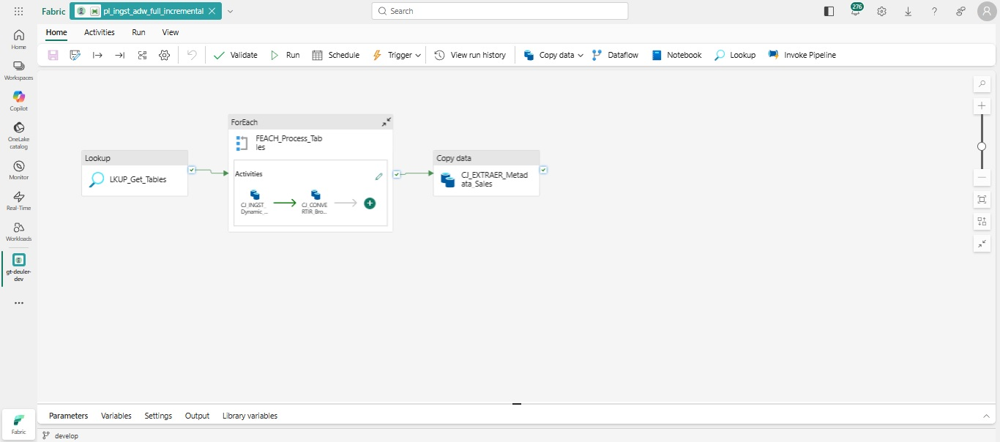

<h1 align="center">
π Data Strategy & Consulting
</h1>

# Data Ingestion Pipeline: Microsoft Fabric & AdventureWorks 🚀

Este proyecto implementa una solución de ingeniería de datos en **Microsoft Fabric** para la extracción automatizada y dinámica de datos desde una base de datos local (**AdventureWorks2019**) hacia un entorno de nube, siguiendo una arquitectura de Medallón.

## 📋 Descripción del Proyecto

El objetivo es centralizar la ingesta de múltiples esquemas (`Sales`, `Production`, `Person`) mediante un único pipeline parametrizado. La solución distingue automáticamente entre cargas completas (**Full**) y cargas incrementales (**Incremental**) basándose en metadatos.

### Características Principales:
* **Orquestación Única:** Un solo pipeline gestiona todas las extracciones.
* **Ingesta Dinámica:** Uso de un Lakehouse de configuración para control de tablas y parámetros.
* **Cargas Incrementales:** Implementación de lógica temporal para tablas transaccionales (`SalesOrderHeader` y `SalesOrderDetail`).
* **Arquitectura Medallón:**
    * **Landing (Files):** Almacenamiento en formato Parquet particionado por fecha.
    * **Bronze (Tables):** Tablas en formato Delta con metadatos de auditoría.

---

## 🏗️ Arquitectura de la Solución

El flujo de datos está diseñado para ser escalable y trazable:

### Flujo de Trabajo:
1.  **Conectividad:** Uso de **On-Premises Data Gateway** para acceder a SQL Server local.
2.  **Capa Landing:** Los datos se depositan en `Files/proyecto/fuente/<esquema>/<tabla>/AAAAMMDD/` en formato **Parquet**.
3.  **Capa Bronze:** Los archivos Parquet se cargan en tablas **Delta**, añadiendo columnas de auditoría:
    * `ingestion_date_ts`: Marca de tiempo exacta de la ingesta.
    * `pl_run_id`: ID único de la ejecución del pipeline.

---

## 🛠️ Tecnologías Utilizadas

* **Microsoft Fabric:** Data Factory (Pipelines), Lakehouses (Config, Landing, Bronze).
* **Base de Datos:** SQL Server (AdventureWorks2019).
* **Formatos:** Parquet y Delta Lake.
* **Seguridad:** MS Authenticator y On-Premises Gateway.

---

## ⚙️ Configuración y Parámetros

El pipeline `pl_ingst_adw_full_incremental` utiliza parámetros dinámicos para mayor flexibilidad:

| Parámetro | Tipo | Lógica por Defecto |
| :--- | :--- | :--- |
| `fechaDesde` | String | Fecha del día actual - 1 (T-1). |
| `fechaHasta` | String | Fecha del día actual (Today). |

### Lógica de Carga:
* **Tablas Transaccionales:** Se filtran mediante `WHERE OrderDate BETWEEN fechaDesde AND fechaHasta`.
* **Resto de Tablas:** Se realiza una carga **Full** para asegurar la integridad de dimensiones y catálogos.

---

## 📁 Estructura del Repositorio

* `pl_ingst_adw_full_incremental.json`: Definición del pipeline en formato JSON (Azure Resource Manager template).
* `manifest.json`: Archivo de metadatos del despliegue.
* `pipe.jpg`: Captura visual de la lógica del pipeline.
* `docs/`: Documentación técnica adicional.

---

## 🚀 Cómo Ejecutar
1. Configurar el **On-Premises Data Gateway** y crear la conexión en Fabric.
2. Crear los Lakehouses: `lh_config`, `lh_landing` y `lh_bronze`.
3. Cargar la tabla `table_load_config` en el Lakehouse de configuración.
4. Importar el archivo JSON del pipeline y ejecutar.

---
**Proyecto desarrollado para:** PI Data Strategy & Consulting - Get Talent v4  
**Aprendiz:** Euler Diego